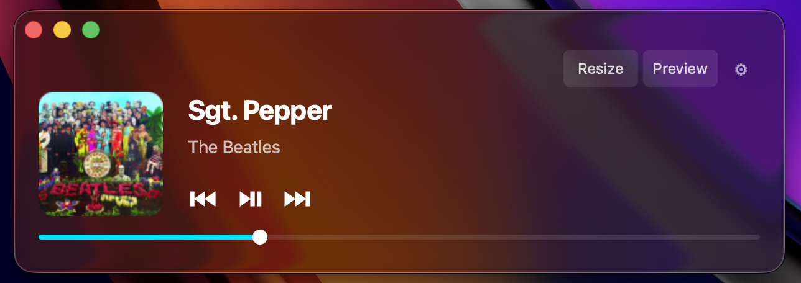
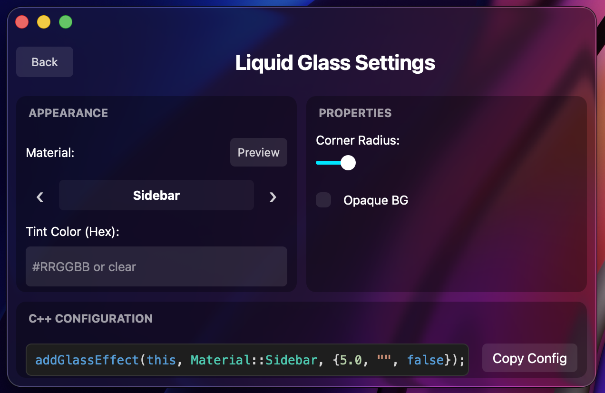
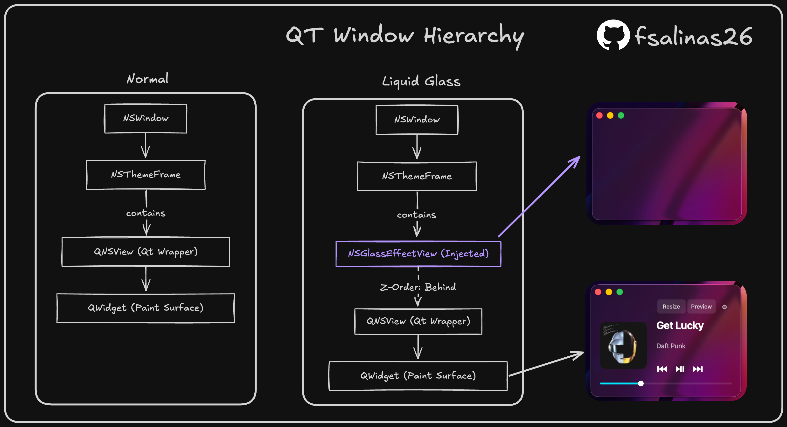

# qt-liquid-glass

<div align="center">
  
  
  <br><br>

  **Modern macOS glass effects for Qt6 applications**
  
   Instantiates AppKit’s private `NSGlassEffectView` directly through Objective-C runtime.


</div>

---

## ✨ Features

-  **Native Glass Effects** - Real `NSGlassEffectView` integration (Private API) with `NSVisualEffectView` fallback.
- ⚡ **Qt Integration** - Works seamlessly with `QWidget` and `QMainWindow`.
-  **Fully Customizable** - Corner radius, tint colors, and glass materials (Sidebar, HUD, Popover, etc.).
-  **Frameless Ready** - Smart injection strategy handles standard windows AND frameless windows (`Qt::FramelessWindowHint`).
-  **Auto Appearance** - Respects system light/dark mode.

## 🚀 Installation

This is a standard CMake library. Clone it into your project or add as a submodule.

```cmake
# In your CMakeLists.txt
add_subdirectory(QtLiquidGlass)
target_link_libraries(YourApp PRIVATE QtLiquidGlass)
```

### Requirements
- **macOS 10.14+**
- **Qt 6.2+** (Core, Widgets)
- **CMake 3.16+**

> **Note**: This package only works on macOS. On other platforms, it compiles but performs safe no-ops.

## 🎯 Basic Usage

```cpp
#include "QtLiquidGlass/QtLiquidGlass.h"
#include <QMainWindow>

int main(int argc, char *argv[]) {
    QApplication a(argc, argv);

    // 1. Create your window
    QMainWindow window;
    
    // 2. Setup for Glass (Frameless looks best)
    window.setWindowFlags(Qt::Window | Qt::FramelessWindowHint);
    window.setAttribute(Qt::WA_TranslucentBackground); // Critical for transparency
    
    // 3. Apply the Liquid Glass Effect
    QtLiquidGlass::Options opts;
    opts.cornerRadius = 16.0;
    opts.tintColor = ""; // Clear tint (or "#RRGGBB")
    opts.opaque = false; // Allow desktop to show through

    // Create the effect behind the window
    // Supported Materials: Sidebar, Sheet, Hud, WindowBackground, Popover, Menu, FullscreenUI, ControlCenter
    QtLiquidGlass::addGlassEffect(&window, QtLiquidGlass::Material::Sidebar, opts);

    window.resize(600, 400);
    window.show();

    return a.exec();
}
```

## 🎛️ Demo Application

The included example demonstrates how to switch materials and configure properties in real-time.

<div align="center">
  
</div>

## 📚 API Documentation

### Methods

| Method | Description |
|--------|-------------|
| `addGlassEffect(widget, material, options)` | Applies the glass effect behind the widget. Returns an `int` ID. |
| `configure(id, options)` | Updates radius, tint, opacity dynamically for an existing effect. |
| `remove(id)` | Removes the effect and cleans up native views. |

### Materials

| Enum | Description |
|------|-------------|
| `Material::Sidebar` | Thick, vibrant blur (Standard macOS sidebar) |
| `Material::Sheet` | Lighter blur for modal sheets |
| `Material::Hud` | Dark, satiny material for HUDs |
| `Material::Popover` | Standard popover material |
| `Material::WindowBackground` | Subtle background blur |
| `Material::FullscreenUI` | Deep blur for fullscreen content |
| `Material::ControlCenter` | Modern, translucent module background |

## 🏗️ How It Works

Qt-liquid-glass uses a smart injection strategy to place the native glass layer correctly behind Qt's rendering surface, regardless of whether you use a standard title bar or a frameless window.

<div align="center">
  
</div>

1.  **Native Backend**: Uses Objective-C++ to inject a native `NSView` into the window hierarchy.
2.  **Smart Injection**: 
    *   **Standard Windows**: Injects the glass view as a *sibling* behind the Qt root view in the `NSThemeFrame`.
    *   **Frameless Windows**: Performs a "Content Swap" to wrap the Qt view in a container, ensuring the glass sits strictly behind the Qt rendering layer.
3.  **Transparency**: Automatically forces the `NSWindow` to be transparent so the blur shows through.

## 🙏 Acknowledgments

This library is built upon the research by the [electron-liquid-glass](https://github.com/Meridius-Labs/electron-liquid-glass) project. We gratefully acknowledge their discovery and reverse-engineering of Apple's private `NSGlassEffectView` API documentation and the mapping of its variant properties, which provided the foundation for this native Qt port.

## 📄 License
MIT
